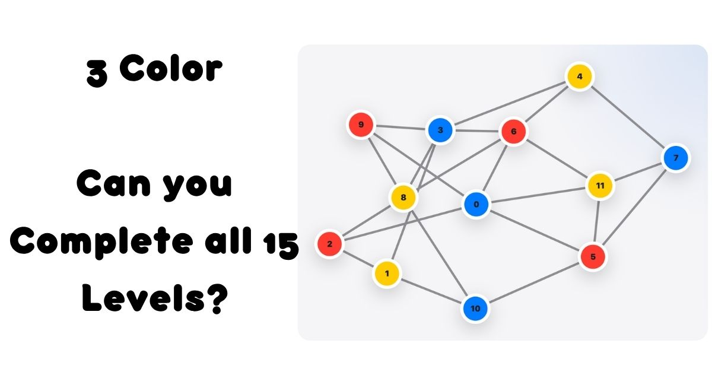

# 3Color

3Color is an interactive browser puzzle game based on the graph 3-coloring problem.

**Live Site:** https://3color.vercel.app/



## Overview

The goal of 3Color is simple: color every circle so that no two connected circles have the same color. The game starts with easier puzzles and gradually introduces more complex graphs that require more careful planning.

This project was built to make graph coloring more visual, playable, and accessible to people without a computer science background.

## Features

- 30 progressive campaign levels
- Random graph mode
- Conflict detection
- Recolor, reset, and timer tracking
- Mobile-friendly layout
- Social sharing preview and analytics

## Tech Stack

- React
- Vite
- JavaScript
- CSS
- Vercel

## Background

This project grew out of an earlier 3-coloring algorithm project, where I explored approaches to graph coloring. I built this interactive version to make the concept more visual, playable, and accessible to people without a computer science background.

## Running Locally

Clone the repository:

```bash
git clone https://github.com/DialoSall/3Color-Simulator.git
```

Move into the project folder:

```bash
cd 3Color-Simulator
```

Install dependencies:

```bash
npm install
```

Start the development server:

```bash
npm run dev
```

Create a production build:

```bash
npm run build
```

Preview the production build locally:

```bash
npm run preview
```

## Mobile Testing Locally

To test the local development version on a phone connected to the same WiFi network:

```bash
npm run dev -- --host 0.0.0.0
```

Then open the network URL shown in the terminal on your phone.

## Future Improvements

* Daily puzzles
* Shareable completion results
* More campaign levels
* User-created puzzle sharing
* Improved challenge tracking
* Optional leaderboard or community puzzle system

## Author

Built by [Dialo Sall](https://github.com/DialoSall).


